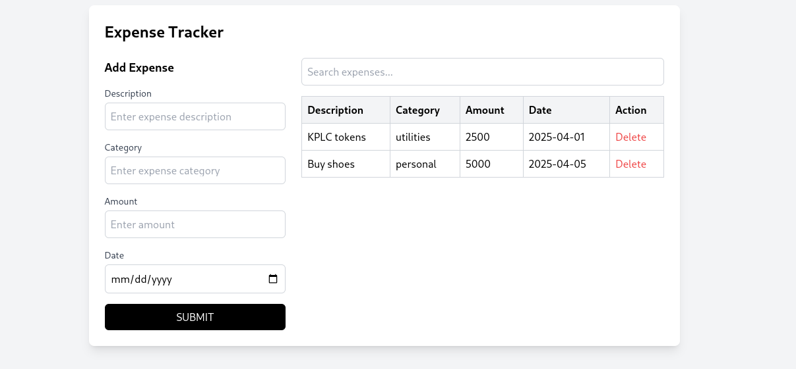

# Expense Tracker



## Overview

Expense Tracker is a React-based web application built as part of a Phase 2 code challenge to demonstrate proficiency in React, state management, component-based architecture, and UI/UX design. The app allows users to manage their expenses by adding, viewing, searching, sorting, and deleting expense records. It is styled with Tailwind CSS to match a provided design mockup and deployed on Vercel for accessibility.

---

## Features

- **View Expenses**: Displays a table of all expenses with columns for Description, Category, Amount, and Date.
- **Add Expenses**: Users can fill out a form to add new expenses, which are immediately reflected in the table without a page refresh.
- **Search Functionality**: A search bar filters expenses by description or category in real-time.
- **Sort Expenses**: Users can sort the table alphabetically by clicking on the "Description" or "Category" headers (advanced deliverable).
- **Delete Expenses**: Each expense row includes a "Delete" button to remove it from the table (advanced deliverable).
- **Responsive UI/UX**: Styled with Tailwind CSS to match the provided mockup, ensuring a clean, user-friendly, and responsive design.
- **Deployment**: Hosted on Vercel for easy access and sharing.

---

## Tech Stack

- **Frontend Framework**: React (using Vite as the build tool)
- **Styling**: Tailwind CSS (version 3) with PostCSS and Autoprefixer
- **State Management**: React's `useState` hook
- **Deployment**: Vercel
- **Version Control**: Git and GitHub

---

## Project Structure

```
expense-tracker/
├── public/
│   └── vite.svg
├── src/
│   ├── assets/
│   │   └── react.svg
│   ├── components/
│   │   ├── ExpenseForm.jsx    # Form component for adding expenses
│   │   ├── ExpenseTable.jsx   # Table component for displaying expenses
│   │   └── SearchBar.jsx      # Search bar component for filtering expenses
│   ├── App.jsx                # Main app component with state management
│   ├── App.css
│   ├── index.css              # Tailwind CSS directives
│   └── main.jsx               # Entry point for the React app
├── index.html
├── package.json
├── tailwind.config.js
├── postcss.config.js
├── vite.config.js
├── README.md
└── .gitignore
```

- **Components**: Separated into reusable components (`ExpenseForm`, `ExpenseTable`, `SearchBar`) for modularity.
- **State Management**: Centralized in `App.jsx` using `useState` for expenses, search term, and sorting.
- **Styling**: Tailwind CSS is configured to apply utility classes across all components.

---

## Setup and Installation

Follow these steps to set up and run the project locally.

### Prerequisites

- Node.js (v16 or higher)
- npm (v8 or higher)
- Git

### Installation Steps

1. **Clone the Repository**:
   ```bash
   git clone https://github.com/AmedDavid/expense-tracker.git 
   cd expense-tracker
   ```

2. **Install Dependencies**:
   ```bash
   npm install
   ```

3. **Run the Development Server**:
   ```bash
   npm run dev
   ```
   The app will be available at `http://localhost:5173` (or the port specified by Vite).

4. **Build for Production** (optional):
   ```bash
   npm run build
   ```

---

## Deployment

The project is deployed on Vercel for live access. Follow these steps to deploy your own instance:

1. **Initialize Git**:
   ```bash
   git init
   git add .
   git commit -m "Initial commit: Expense Tracker app"
   ```

2. **Push to a Remote Repository**:
   - Create a new repository on GitHub.
   - Link your local repo:
     ```bash
     git remote add origin <your-repo-url>
     git push -u origin main
     ```

3. **Deploy to Vercel**:
   - Install the Vercel CLI:
     ```bash
     npm install -g vercel
     ```
   - Log in to Vercel:
     ```bash
     vercel login
     ```
   - Deploy the project:
     ```bash
     vercel
     ```
   - Follow the prompts to deploy. Vercel will auto-detect the Vite framework and deploy the app.
   - Access the deployed app at the provided URL (e.g., `https://expense-tracker.vercel.app`).

---

## Challenges Faced and Solutions

During the development of this project, I encountered a few challenges, particularly during the setup phase. Here's how I resolved them:

### Challenge 1: Issues with Bun + Vite Setup
- **Problem**: I initially tried to create the project using Bun with Vite (`bun create vite@latest expense-tracker -- --template react`) to leverage Bun's faster performance. However, I faced compatibility issues when linking Tailwind CSS. Bun's package manager struggled with some of Tailwind's peer dependencies, and the `npx tailwindcss init -p` command failed to generate the necessary configuration files properly.
- **Solution**: I switched to using npm as suggested in the official Tailwind CSS documentation for Vite projects. I ran the following commands to set up the project:
  ```bash
  npm create vite@latest expense-tracker -- --template react
  cd expense-tracker
  npm install -D tailwindcss@3 postcss autoprefixer
  npx tailwindcss init -p
  ```
  This resolved the compatibility issues, and Tailwind CSS was successfully integrated.

### Challenge 2: Styling to Match the Mockup
- **Problem**: The provided UI/UX mockup required a clean, responsive design with specific styling for the form, table, and search bar. Initially, the layout did not match the mockup, especially the form and table alignment.
- **Solution**: I used Tailwind CSS's utility classes to style the components. I applied flexbox for layout (`flex`, `md:flex-row`, `gap-6`), ensured responsiveness with media queries (`md:w-1/3`, `md:w-2/3`), and added borders and hover effects to the table (`border`, `hover:bg-gray-50`). I also styled the form's submit button to match the mockup's black button (`bg-black`, `text-white`).

### Challenge 3: Implementing Sorting and Deletion (Advanced Deliverables)
- **Problem**: Implementing sorting by category or description and deleting expenses required careful state management to avoid breaking the core functionality.
- **Solution**: I added a `sortField` state in `App.jsx` to track the sorting field and implemented a sorting function using JavaScript's `localeCompare`. For deletion, I added a `deleteExpense` function that filters out the selected expense by index. Both features were integrated into the `ExpenseTable` component with clickable headers for sorting and a "Delete" button per row.

---

## Future Improvements

- **Persistence**: Add local storage or a backend to persist expenses between sessions.
- **Enhanced Sorting**: Allow sorting in ascending and descending order.
- **Edit Functionality**: Enable users to edit existing expenses.
- **Improved Styling**: Add animations or transitions for a smoother user experience.

---
